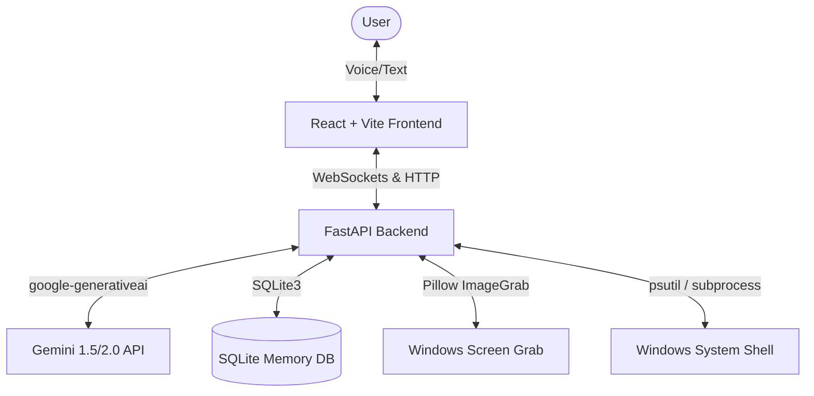

# Ally: Production-Grade Personal AI Companion 🤖

Ally is a production-grade personal AI companion that communicates naturally via voice and text, monitors and understands active desktop contexts, manages persistent memories about its user, and performs safe system automation tasks with interactive permissions.

## Key Features

1. **Futuristic Glassmorphic Cockpit**: A premium UI styled with custom CSS animations, neon accent rings, and responsive cards.
2. **Dynamic 3D-Like Glowing Orb**: A voice-reactive canvas orb mapping four cognitive states:
   - **Idle**: Calm, rotating gradients.
   - **Listening**: Sonar rings pulsing to detect your command.
   - **Thinking**: Intense violet particles swirling as it interfaces with Gemini.
   - **Speaking**: Visualizer waves dancing in synchrony with speech synthesis.
3. **Voice Command & Wake-Word Loop**: Integrated continuous listener activated by saying **"Hey Ally"** or clicking the mic. Returns real-time speech synthesis (TTS) response.
4. **Active Screen Vision**: Captures high-res compressed screen frames and relays them to Gemini Multimodal Vision API when you request screenshot checks or context explanations.
5. **Interactive System Automation**: Safely lists running processes, reads or writes system files, and schedules PowerShell command executions after explicit approval via the Automation Shield.
6. **SQLite Long-Term Memory**: Automatically records and retrieves user preference records, profile facts, and project notes.

---

## Architecture Diagram



---

## Quick Setup

### System Prerequisites
Ensure you have the following installed:
- **Python 3.10+** (tested with Python 3.14)
- **Node.js v18+** & **npm**
- **Git**

### Installation Steps

1. **Clone the Repository:**
   ```bash
   git clone https://github.com/vaibhav1874/ally.git
   cd ally
   ```

2. **Configure API Keys:**
   Copy `.env.example` in the root into `backend/.env`:
   ```bash
   copy .env.example backend\.env
   ```
   Open `backend/.env` in a text editor and fill in your **GEMINI_API_KEY**. You can obtain a free key from [Google AI Studio](https://aistudio.google.com/).

3. **Install Dependencies:**
   Install backend Python requirements:
   ```bash
   pip install -r backend/requirements.txt
   ```
   Install frontend React packages:
   ```bash
   cd frontend
   npm install
   cd ..
   ```

---

## Launching Ally

### Quick Start (Windows)
Double-click the **`start.bat`** file in the root of the workspace. 

This launcher script automatically:
- Starts the FastAPI local server on `http://127.0.0.1:8000`.
- Launches the Vite React server on `http://localhost:5173`.
- Verifies and copies environment templates if missing.

### Manual Launch

- **Start Backend:**
  ```bash
  cd backend
  python -m uvicorn main:app --reload --port 8000
  ```
- **Start Frontend:**
  ```bash
  cd frontend
  npm run dev
  ```
  Open your web browser and navigate to `http://localhost:5173`.

---

## Usage Guide

- **Voice Dialogue**: Click the microphone icon to toggle active listening. Or toggle "Continuous Wake Listening" in settings, then speak **"Hey Ally"** to activate conversation naturally.
- **Multimodal Screen Analysis**: Check the screenshot icon next to input box. Type: *"What code do I have open right now?"* or *"Explain this webpage"* to capture your active monitor context and process it.
- **Persistent Memory**: Type: *"Remember that my project deadline is tomorrow"* or *"Remember my name is Vaibhav"*. Confirm memory is recorded by viewing the **Memory Hub** tab.
- **Automations**: Type: *"List the files in my current directory"* or *"Queue a command to list network sockets"*. Review the script block inside the **Automation Center** and click **Approve** to execute.
